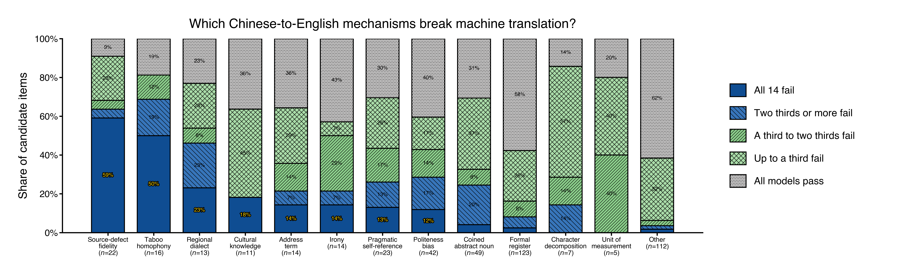
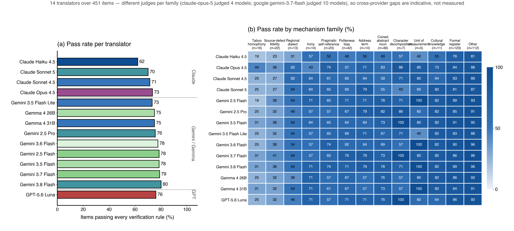
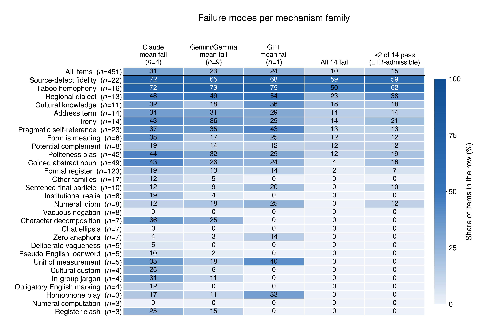
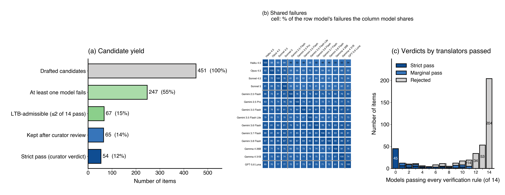
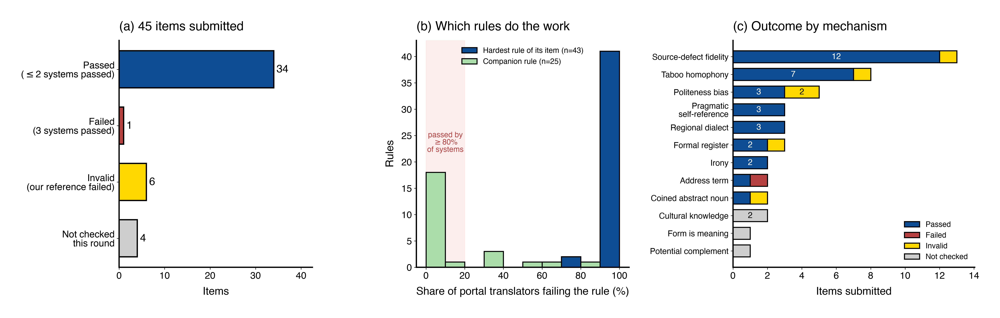

# LTB-AI — AI generated Chinese→English candidates for the Last Translation Benchmark

This repository is for Chinese→English translation following the setup of the **Last Translation Benchmark** (LTB):
Chinese source texts that should be translatable by a competent human but that
current machine translation gets wrong, each paired with a "perfect" translation
and pass/fail verification rules for an AI judge. But everything is automated by AI.

This README presents what the current candidate pool looks like.

## Contents

```
data/            ltb_all_models.jsonl   — 452 candidates with all 14 translators' output
                 ltb_validation.jsonl  — the 45 sent to the official portal, with its verdicts
                 strict_passes_all_models.md — the submittable items, readable
visualization/   plotting scripts, roster-agnostic (see visualization/README.md)
benchmark/       translator probes: the Claude roster (judged by Opus 5) and a
                 10-model Gemini/Gemma/GPT roster (judged by Gemini 3.7 Flash),
                 a collector that merges both, and run_pipeline.py to chain them
results/         probe output (written by the two runner scripts)
png/             figures, 300 dpi raster
pdf/             figures, vector
```

## The data

[`data/ltb_all_models.jsonl`](data/ltb_all_models.jsonl) holds **452 drafted candidates**,
all Chinese→English, annotated with:

- `mechanism_en` / `mechanism_zh` — the linguistic mechanism the item targets
  (**251 distinct labels**, collapsing at the colon into **38 families**, e.g.
  `Formal register: legal terminology` → family `Formal register`).
- `source`, `perfect_translation`, `verification_rules` (615 rules; 1 for 289 items, 2 for 163).
- `model_outputs`, `model_passed_rules` and `model_passed_each_rule` for **fourteen
  translators** across three providers — four Claude, nine Gemini/Gemma, one GPT —
  plus `judge_reasons`, one line of reasoning per rule. A model "passes" an item only
  when its translation satisfies *every* rule written for it.
- `judges` — each rule of each translation was judged individually: **Claude Opus 5**
  for the Claude column, **Gemini 3.7 Flash** for the rest. `translators` lists the
  roster, `n_translators_passed` / `n_translators_total` count how many passed out of
  how many, and `n_claude_passed` / `n_claude_total` keep the Claude-only view beside
  it, so a row never depends on knowing which roster produced it.
- `candidate_verdict` — the curator's call over the Claude roster: **`strict_pass`
  (75)** when no translator passes, **`marginal_pass` (37)** when exactly one does,
  **`rejected` (340)** when two or more do. Measured against all fourteen, **45 items
  defeat everything**, and those are what went to the portal. Three items carry a `curator_override` and stay rejected however the
  translators score, because they fail LTB's fairness or confidence bar rather than the
  arithmetic (`FORM-MEME-01`, `SLOGAN-02`, `POL-COL-01`). `previous_verdict` keeps the
  earlier two-model call for comparison.


Every figure reports translator results, with consistent colour:

| Colour | Meaning |
|---|---|
| Blue `#0F4D92` | All models fail the item's rules — a useful benchmark item |
| Green `#8BCF8B` | Some but not all models fail |
| Neutral `#CFCECE` | Every model passes — the item is not adversarial |

Every figure sizes itself from the roster declared in `visualization/ltb_data.py`, so
the fourteen-translator view below is what `plot_all.py` produces from the dataset as it
stands; restricting it to a subset is an edit to that one list, or an `LTB_MODELS`
override.

## Headline result

Drafting candidates is cheap; drafting candidates that actually break a translator
is not. **204 of 451 drafts (45%) are solved by all fourteen translators, and only 45
(10%) are missed by every one of them.** Of those 45, **34 have now been confirmed by
the official LTB portal** against a roster we never ran. Difficulty is also
very unevenly distributed across mechanisms: the family drafted most heavily is the
one that works worst.

---

## 1. The corpus in brief

The pool holds **452 items** across **38 mechanism families** and
251 distinct `mechanism_en` labels, carrying **615 verification rules** (64% of items
have one rule, the rest two).

Sources are short — median **19 characters**, range 5-61 — single utterances of speech
or prose rather than documents, and length barely varies across families, so difficulty
comes from what is packed into those characters rather than from size.

Coverage is uneven and worth keeping in mind when reading any per-family rate.
`Formal register` alone holds **123 items (27%)**, and **16 of the 38 families have
four items or fewer**. Family-level rates on
the large families are worth acting on; a family of three is a pointer, not a
measurement. Every figure prints its own $n$ so the two are never confused.

## 2. Which mechanisms break machine translation



Each bar is one mechanism family, split by how much of the fourteen-model roster the
item defeats.

- **Source-defect fidelity** defeats all fourteen on **13 of 22 items (59%)** and **taboo
  homophony** on **8 of 16 (50%)** — the two most productive families in the pool, and
  both punish the same reflex: the model tidies up or resolves what the source left
  broken or unsaid. **Regional dialect** (23%) and **cultural knowledge** (18%) follow.
- **Formal register** defeats all fourteen only **2%** of the time (3 of 123), yet it is
  **27% of everything drafted** — the volume sits in the wrong place.
- **Pseudo-English loanword** (0/5) never worked: embedded English tokens with
  shifted Chinese meanings (`玩得太high`, `有点emo`, `今晚AA`, `很会social`, `磕CP`)
  were handled correctly by every model every time.

## 3. The translators



Panel (a) is one bar per translator, blocked by provider; panel (b) breaks the same
rate down by mechanism family. 

**Gemini 3.8 Flash leads at 80%** and **Claude Haiku 4.5 trails at 62%**; the other
twelve sit between 71% and 79%. Model generation and size buy remarkably little —
Claude Opus 4.5, the largest model in the roster, lands at 74%, below five Gemini
Flash variants.

Haiku is the outlier rather than the rest being alike everywhere. It is last in almost
every family, and furthest behind on *form is meaning*, where it passes 25% against
Gemini 2.5 Pro's 88%. Elsewhere the ordering shuffles: *irony* is hardest for Claude Opus
4.5 (43%) and easiest for Gemini 2.5 Flash (71%), while *taboo homophony* reverses that —
Opus 4.5 leads at 44% and Haiku trails at 19%. Tuning an item against one model, or one
provider, will not generalise across the roster.

The families that defeat one provider defeat the others too: **taboo homophony runs
19-44% across the whole roster and source-defect fidelity 23-41%**, the two lowest
columns for all fourteen systems. Note the two provider groups were judged by
different judges (Opus 5 and Gemini 3.7 Flash), so the *gap between* providers is
indicative while the *ranking within* one is measured.

## 4. Failure modes per family



Rows are families (n ≥ 3 items, smaller ones pooled), columns are percentages within the
row. Above six translators the per-model columns aggregate into one mean-failure column
per provider, then joint failure, then the share clearing LTB's bar of at most two
passing translations. Strict pass has no column of its own — a verdict is strict exactly
when the whole roster fails, so it would duplicate the joint column cell for cell.

Two patterns worth naming:

- **The top two rows are hard for everyone.** Taboo homophony and source-defect fidelity
  are the lowest columns for Claude, Gemini and GPT alike — 19–44% and 23–41% across the
  fourteen — so these are properties of the task, not of one lab's models.
- **Single-provider traps are weak submissions.** A family that only Haiku fails, or only
  the Claude column, looks striking in isolation and dies the moment a reviewer runs
  Google Translate. The `≤2 of 14 pass` column is the one to read before submitting
  anything.

## 5. What survives the pipeline



- **(a)** 451 items measured against all fourteen → 247 (55%) break at least one
  translator → 67 (15%) clear LTB's admissibility bar of at most two passing
  translations → **45 (10%) defeat every translator**.
- **(b)** Failures overlap heavily: Haiku 4.5 fails 171 items, Sonnet 5 135, Sonnet 4.5
  129, Gemini 3.5 Flash 121, and every pair of the fourteen shares between 71 and 110
  of those failures. Items are hard for the field, not for one model. The panel groups
  the roster by provider, which shows Haiku sharing only 41-61% of its failures with
  the rest while the Gemini models share 70-88% with each other.
- **(c)** Verdict by number of passing translators, against the curator's
  Claude-roster call. The two disagree by construction — 30 items are strict on the
  Claude roster but solved by a Gemini or GPT model — which is exactly why the
  fourteen-model view is the one worth submitting from.

## 6. Inside `Formal register`

Formal register is the largest family in the pool, so it is worth saying what it does and
does not buy. Only **3 of 123** items defeat all fourteen translators — one funerary
honorific and two one-item subtypes — and **11 of the 38 subtypes** never fail a single
model: on plain formal English every model in the roster delivers on demand.

**Takeaway for further drafting.** "Make it very formal" is not a difficulty
mechanism for current models. What survives is register that encodes *who is speaking
to whom* (honorific direction, natal vs affinal kin, humble self-reference) or *form
that carries meaning* (shape, acrostic, slogan constraint).

## Side observation: rule count tracks real difficulty

Items with **two** rules for defeat all fourteen translators 30/162 (19%); single-rule
items manage 15/289 (5%). This is an
association, not a cause, but it makes rule count a cheap triage signal when
deciding which drafts to keep polishing.

## Checked against the official portal



The 45 items that defeat all fourteen translators were run through the official LTB
portal's checking tool, which uses its own roster of eleven systems — Lara, Google Translate, Gemini
3.1 Pro, Gemma 4, Llama 4 Maverick, GPT-6 Astra, GPT-5.6 Sol, Deepseek V4 Pro, Claude
Sonnet 4.5, Gemini 3.8 Flash, Claude Haiku 4.5 — and judges the reference translation
alongside them. 41 have come back. **These were never submitted for review**, and the portal was used here only to measure the
pipeline's output.

| Outcome | Items |
|---|---:|
| **Cleared the bar** (≤2 systems passed) | **34** |
| Over the bar (3 systems passed) | 1 |
| Invalid — our own reference failed its rules | 6 |
| Not checked (credits ran out) | 4 |

Three findings worth carrying into the next batch:

- **Our references cost more than our items' difficulty did.** Six items died because
  the perfect translation failed the rules written for it — LTB judges the reference
  too, and a rule that the own reference cannot meet is broken, not strict.
- **Nearly every item is carried by one rule.** Panel (b): 43 rules failed almost every
  system, while 19 of 68 were passed by nine or more of eleven. LTB explicitly
  discourages rules most models pass.
- **Our roster overstates difficulty.** The single genuine failure, `ADDR-REG-01`, was
  0/14 here and 3/11 there — Google Translate, GPT-5.6 Sol and Deepseek all solved it.

Panel (c) shows where the survivors are concentrated: source-defect fidelity (12 of the
13 checked) and taboo homophony (7 of 8).

## How the dataset was judged

Two probes produced the dataset's `model_outputs` / `model_passed_rules` fields between
them: [`benchmark/run_claude_probe.py`](benchmark/run_claude_probe.py) for the four Claude
translators, judged by **Claude Opus 5**, and
[`benchmark/run_translators.py`](benchmark/run_translators.py) for the ten Gemini / Gemma /
GPT translators, judged by **Gemini 3.7 Flash**. Both rule on **each verification rule
separately** — 6,327 translations and 8,608 rule judgements over the pool. The Claude
probe is described below; the other is in
[benchmark/README.md](benchmark/README.md).
This machine authenticates through Claude Code and has no `ANTHROPIC_API_KEY`, so the
probe calls models through the headless `claude -p` CLI with `--system-prompt`, which
replaces the agent system prompt entirely: each call is a plain single-turn model call
with no tools and no session state.

```bash
cd benchmark
python3 run_claude_probe.py --list-models          # roster and judge
python3 run_claude_probe.py --dry-run --limit 3    # free, no calls
python3 run_claude_probe.py --limit 5              # small live slice
python3 run_claude_probe.py --concurrency 12 --yes # full pool, ~4,300 calls
python3 collect_results.py --report                # coverage table, writes nothing
```

Claude Fable 5 is *not* in the roster: it needs usage credits this account does not
have. Every call is checkpointed as it returns, which mattered — the full run hit a
session limit twice, and re-running the same command picked up exactly the tasks that
had failed.

Two caveats. The judge, Opus 5, is one family with the translators, and Opus 4.5 in
particular is a near-neighbour it may score generously. And re-judging moved 58 of 550
verdicts on translations that did not change at all (50 stricter, 8 more lenient
than the earlier judge), which is a fair estimate of how much any single judge's
calibration is worth.

## Probing more translators

The Claude models in the dataset are only a proxy for what LTB
runs. [`benchmark/run_translators.py`](benchmark/run_translators.py) widens that
to a 10-model roster — Gemini 2.5 Pro/Flash, Gemini 3.5 Flash/Flash Lite,
Gemini 3.6 Flash, Gemini 3.7 Flash, Gemini 3.8 Flash, Gemma 4 26B/31B
and GPT-5.6 Luna — judged by Gemini 3.7 Flash. (GPT-5.6 Sol is excluded on
cost.) It covers the Chinese-to-English items only,
translates each one, judges the translation against **each** of the item's
verification rules separately, and writes results in the same shape as the
dataset.

```bash
python3 -m pip install --user google-genai   # add `openai` for GPT-5.6 Luna
export GOOGLE_API_KEY='...'
cd benchmark

python3 run_translators.py --dry-run --limit 5                    # free, no key
python3 run_translators.py --verify-models                        # do the ids exist?
python3 run_translators.py --model google:gemma-4-26b-it --limit 2   # ~5 calls
python3 run_translators.py --model google:gemma-4-26b-it --limit 20  # ~47 calls
python3 run_translators.py --limit 20 --concurrency 8              # ~517 calls
python3 run_translators.py --concurrency 8 --max-calls 8000         # full: ~6,765
```

Every run prints its call estimate first and refuses to exceed `--max-calls`
(default 2,000), so the full sweep has to be asked for explicitly.

Runs are concurrent, filterable by item or mechanism, and **checkpointed per API
call**: every translation and every rule verdict is flushed to
`results/checkpoints.jsonl` as it returns, so a rate limit, a crash or a Ctrl-C
costs only the calls that never completed — re-running the same command picks up
where it stopped. Output goes to `results/translations.jsonl` (per item x model)
and `results/probe_results.jsonl` (per item, dataset-shaped). Staged commands,
a run-size table, all flags and the caveats — including judge bias — are in
[benchmark/README.md](benchmark/README.md).

## The whole pipeline in one command

```bash
cd benchmark
python3 run_pipeline.py --dry-run --limit 3   # rehearse: no calls, no cost
python3 run_pipeline.py --yes                 # claude -> others -> collect -> plots
python3 run_pipeline.py --stages collect,plots
```

The four stages are: **claude** (Claude models translate, Opus 5 judges each rule,
results fold into the pool — with `--new` a freshly drafted batch is judged and
appended), **others** (Gemini/Gemma/GPT translate, judged by Gemini 3.7 Flash),
**collect** (both probes folded into `data/ltb_all_models.jsonl`), and **plots**.
Drafting candidates stays a human job; everything after it is one command. Details
are in [benchmark/README.md](benchmark/README.md).

## Reproducing the figures

```bash
cd visualization
python3 plot_all.py                  # all five figures -> ../png/ and ../pdf/
python3 plot_provider_comparison.py  # or any single figure

# a subset of the roster, or a different file
LTB_MODELS=claude-opus-4-5,gemini-3.8-flash,gpt-5.6-luna python3 plot_all.py
```

Five figures, all about translator results: the roster comparison, which mechanisms
defeat how much of it, the family/failure-mode heatmap, the yield funnel, and the
portal round. Requires only `numpy` and `matplotlib`; the scripts read
[`data/ltb_all_models.jsonl`](data/ltb_all_models.jsonl) and
[`data/ltb_validation.jsonl`](data/ltb_validation.jsonl) directly, so no number in
the figures is hard-coded. Script-level details are in
[visualization/README.md](visualization/README.md), which also records the
figure-style conventions every script follows.
